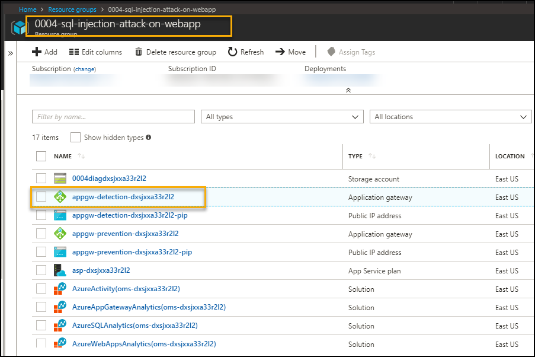
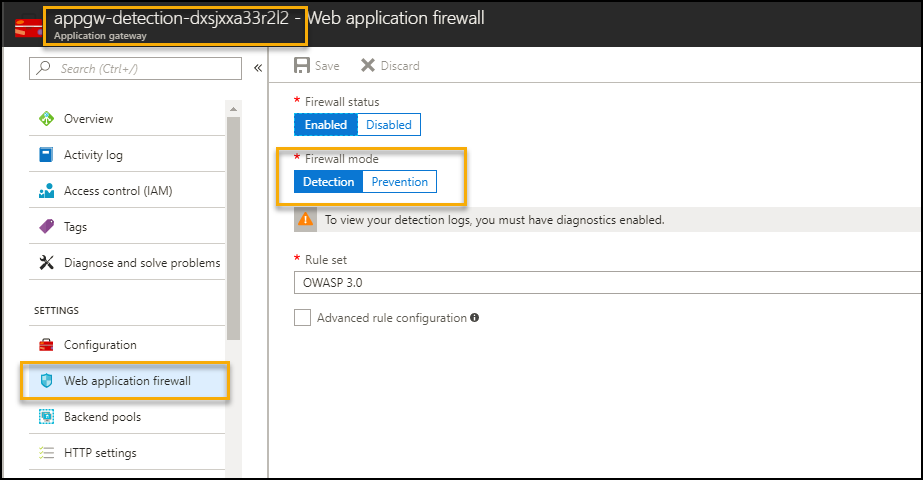
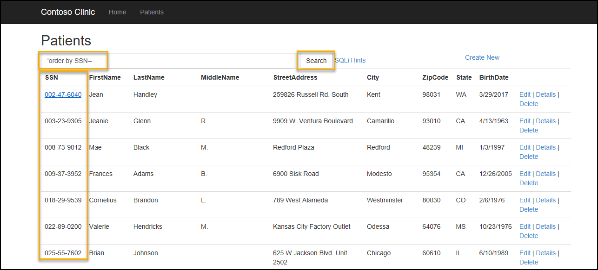
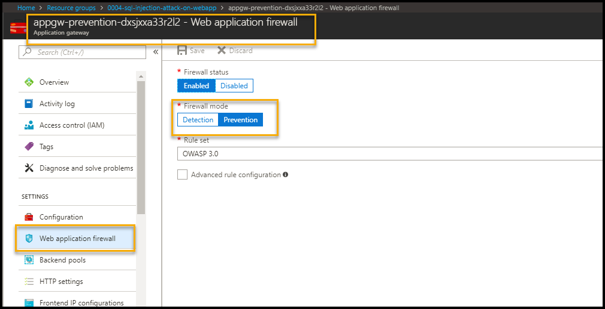

# SQL injection attack on a Web Application Scenario 
This repository contains SQL injection attack detection & prevention on a Web Application <p></p>

<a href="https://portal.azure.com/#create/Microsoft.Template/uri/https%3A%2F%2Fraw.githubusercontent.com%2FAvyanConsultingCorp%2FSQL-Injection-Attack-Prevention%2Fmaster%2F101-SQL-Injection-Attack-Prevention%2Fazuredeploy.json" target="_blank">
     
</a>
<a href="http://armviz.io/#/?load=https%3A%2F%2Fraw.githubusercontent.com%2FAvyanConsultingCorp%2FSQL-Injection-Attack-Prevention%2Fmaster%2F101-SQL-Injection-Attack-Prevention%2Fazuredeploy.json" target="_blank">
     
</a>

# Table of Contents
1. [Objectives](#objectives)
2. [Overview](#overview)
3. [Pre-requisites](#prerequisites)
4. [Deploy](#deployment)
5. [Perform Attack](#attack)
6. [Detect Attack](#detect)
7. [Respond/Mitigate](#mitigate)
8. [Configuration validation](#config)

<a name="objectives"></a>
# Objective of the POC 
Showcase a SQL injection attack detection & prevention on a Web Application (Web App + SQL DB)

<a name="overview"></a>
# Overview
It showcases following use cases
1. Perform SQL injection attack on Web App with following configuration --> Application detects attack using application gateway
    * Application Gateway (WAF enabled-Detection mode)
    * SQL DB with Threat Detection disabled

2. Perform SQL injection attack on Web App with following configuration --> Application detects attack using application gateway and SQL database alert
    * Application Gateway (WAF enabled-Detection mode)
    * SQL DB with Threat Detection enabled and Send
 Alert To selected

3. Perform SQL injection attack on Web App with following configuration --> Application prevents attack
    * Application Gateway (WAF enabled-Prevention mode)
    * SQL DB with Threat Detection enabled and Send Alert To selected


# Important Notes <a name="notes"></a>
Although the deployment takes 10-15mins, the log aggregation by OMS take a few hours to get configured in the backend. You may not see attack/mitigation logs for detection and prevention events during the aggregation time window.   
Subsequently logs will take 10-15 mins to reflect in OMS.


<a name="prerequisites"></a>
# Prerequisites
Access to Azure subscription to deploy following resources 
1. Application gateway (WAF enabled)
2. App Service (Web App)
3. SQL Database 
4. OMS (Monitoring)

<a name="deployment"></a>
# Deploy 

1. Deploy using "Deploy to Azure" button at the top 

2. Execute following command to configure SQL Server Firewall and load data into database.

    `.\DSC\sqlserver.ps1 -ResourceGruopName "<ResourceGroupName>" -SqlAdminUser "<SqlAdminUser>" -SqlAdminPassword <SqlAdminPassword> -Verbose`


<a name="attack"></a>
# Perform Attack 
Attack on web app with
* Application gateway - WAF - Detection mode 
* SQL server and database with Threat Detection disabled. 

1. Go to Azure Portal --> Select Resource Groups services --> Select Resource Group - <prefix> "-sql-injection-attack-on-webapp"

2. Select Application Gateway with name 'appgw-detection-' as prefix.

    

3. Application Gateway WAF enabled and Firewall in Detection mode as shown below.

    

4. On Overview Page --> Copy Frontend public IP address (DNS label) as
    

5. Open Internet Explorer with above details as shown below  
    

6. Click on Patient link it will display list of details 

    

7. Perform SQL Injection attack by copying " **'order by SSN--** " in search box and click on "Search". Application will show sorted data based on SSN.

        
    
    
<a name="detect"></a>
# Detect  
###  Detection using OMS
To detect the attack execute following query in Azure Log Analytics
1. Go to Azure Portal --> navigate to resource group 'azuresecuritypoc-common-resources'  

 

2. Go to Log analytics --> Click on Log Search --> Type query search 

    ```AzureDiagnostics | where Message  contains "Injection" and action_s contains "detected"```

     
    
3. Following details gets logged 

     
    
 ###  Azure Security Center Recommendation
 
1. Azure Security Center gives  recommendations to enable Auditing and Threat Detection and allows you to perform  steps from the console itself.

 

2. Azure Portal > Security Center - Overview > Data Resources > contosoclinic > Enable Auditing & Threat detection on SQL databases >Auditing & Threat Detection 


## Monitor / Detect 

Once Auditing & Threat Detection is database is enabled for SQL database, Azure Security Center sends email alert mentioned in Send alert to field. Execute the step 7 to perform SQL Injection attack


<a name="mitigate"></a>
# Mitigate 

  * Update Web application firewall mode to Prevention for application gateway. This will take 5-10 mins. Hence we will connect the application using Application Gateway (WAF- Prevention mode) 

        
    
  

## Detection after Mitigation

* Execute the step 7 to perform SQL Injection attack, Application Gateway will prevent access

      

 
* To detect the prevention of attack execute following query in Azure Log Analytics


    ```AzureDiagnostics | where Message  contains "injection" and action_s contains "blocked"```
    
      


    You will notice events related to detection and prevention items. First time it takes few hours for OMS to pull logs for detection and prevention events. For subsequent requests it takes 10-15 mins to reflect in OMS, so if you don't get any search results, please try again after sometime.
    
<a name="config"></a>
## Configuration Validation
* The impact SQL injection can have on a business is far reaching. A successful attack may result in the unauthorized viewing of user lists, the deletion of entire tables and, in certain cases, the attacker gaining administrative rights to a database, all of which are highly detrimental to a business. Detection and remediation can be easily done using advanced controls along with Audit and Remediation procedure in Cloudneeti.

* Cloudneeti is available on the Azure marketplace. Try out the free test drive here https://aka.ms/Cloudneeti 


**References** 

https://docs.microsoft.com/en-us/azure/application-gateway/application-gateway-introduction
 
https://docs.microsoft.com/en-us/azure/application-gateway/application-gateway-web-application-firewall-overview
 
https://docs.microsoft.com/en-us/azure/sql-database/


